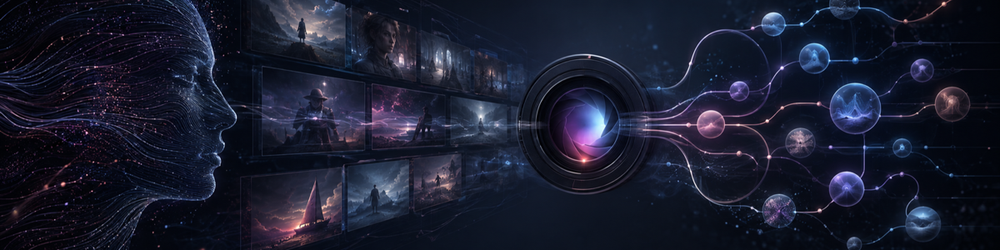

  

  
  
  
  

## 👋 你好，我是 ChengSir

平时喜欢折腾 AI，尤其关注 AI 生图、角色设计、AI 视频和 Agent 工作流。

我喜欢把一个模糊的想法慢慢拆清楚，再整理成可以重复使用的提示词、Skill 和小工具。比起追求一次出图，我更在意人物是否稳定、画面有没有故事，以及整个创作流程能不能持续复用。

## 🎨 我关注的方向

- 🖼️ 怎样把一句简单的人设，扩展成有辨识度的角色和完整画面。
- 🎭 怎样让同一个角色出现在不同服装、场景和镜头里，依然保持一致。
- 🎬 怎样把图片、分镜、动作和运镜连起来，做出更自然的 AI 视频。
- 🧩 怎样把零散的提示词整理成 Agent 能直接调用的 Skill 和工作流。

## 🧪 这里会记录什么

提示词实验、角色设定方法、AI 视频分镜、Codex Skills，以及一些顺手做的小工具。

  ✨ 把灵感变成画面，再把偶然变成可以复用的方法。

